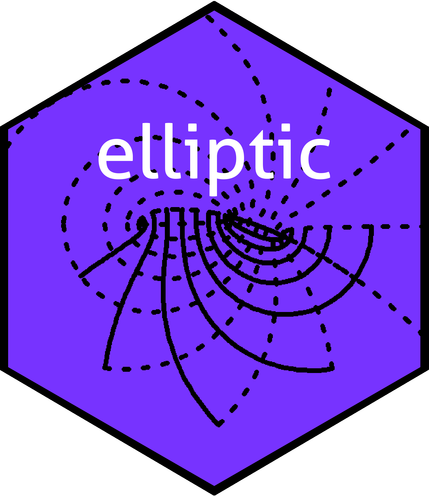
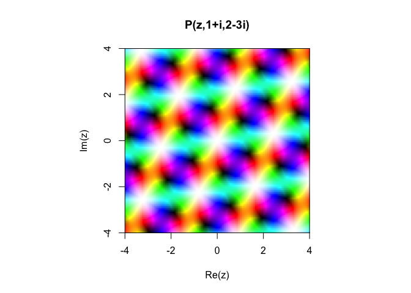
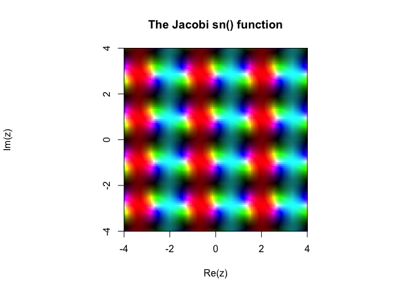
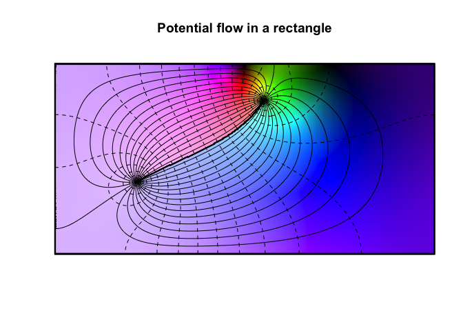

The elliptic package: Weierstrass and Jacobi elliptic functions in R
================

------------------------------------------------------------------------

<!-- README.md is generated from README.Rmd. Please edit that file -->



<!-- badges: start -->

[](https://cran.r-project.org/package=elliptic)


[](https://github.com/RobinHankin/elliptic/actions/workflows/R-CMD-check.yaml)
[](https://app.codecov.io/gh/RobinHankin/elliptic)
<!-- badges: end -->

## Overview

An elliptic function is a meromorphic complex function that is periodic
in two directions. That is, there exist two nonzero complex numbers

with

such that

 = f(z+2\omega_1)=f(z+2\omega_2)")

whenever ")
is defined; note carefully the factors of 2. There are two natural ways
of presenting elliptic functions: that of Weierstrass, and that of
Jacobi. Historically, the Jacobi form was first presented and is the
most practically useful, but the Weierstrass form is more elegant (IMO).

Terminology follows that of Abramowitz and Stegun wherever possible.

# Installation

To install the most recent stable version on CRAN, use
`install.packages()` at the R prompt:

    R> install.packages("elliptic")

To install the current development version use `devtools`:

    R> devtools::install_github("RobinHankin/elliptic")

And then to load the package use `library()`:

``` r
library("elliptic")
```

The package comes with an extensive and detailed vignette; type
`vignette("elliptic")` at the R commandline.

# The package in use

The Weierstrass elliptic function is evaluated numerically by `P()`,
which takes the half periods
.
Thus

``` r
z <- 0.3 + 0.2i
omega1 <- 5+1i; omega2 <- 1+7i  # half-periods
f <- function(z){P(z,Omega=c(omega1,omega2))}
c(f(z),f(z + 10+2i), f(z + 2+14i))  # should be equal
```

    ## [1] 2.958647-7.100563i 2.958647-7.100563i 2.958647-7.100563i

The elliptic functions can be visualised using `view()`:

``` r
x <- seq(from=-4, to=4, len=200)
y <- x
z <- outer(x,1i*x, "+")
f <- P(z, c(1+1i,2-3i))
par(pty="s")
view(x,y,f,real.contour=FALSE,drawlabel=FALSE,axes=FALSE,xlab="Re(z)",ylab="Im(z)", main="P(z,1+i,2-3i)")
axis(1,pos = -4)
axis(2,pos = -4)
lines(x=c(-4,4),y=c(4,4))
lines(y=c(-4,4),x=c(4,4))
```

<!-- -->

Related functions include
")
(`sigma()` and the
")
(`zeta()`).

## Jacobi forms

Jacobi’s elliptic functions are implemented in the package with their
standard names `sn()`, `cn()`, `dn()` etc. For example:

``` r
view(x,y,sn(z,m=6),real=FALSE,drawlabel=FALSE,axes=FALSE,xlab="Re(z)",ylab="Im(z)", main="The Jacobi sn() function")
axis(1,pos = -4,at=c(-4,-2,0,2,4))
axis(2,pos = -4,at=c(-4,-2,0,2,4))
lines(x=c(-4,4),y=c(4,4))
lines(y=c(-4,4),x=c(4,4))
```

<!-- -->

The Jacobi forms are useful in physics and we can use them to visualise
potential flow in a rectangle:

``` r
n <- 300
K <- K.fun(1/2)  # aspect ratio
f <- function(z){1i*log((z-1.7+3i)*(z-1.7-3i)/(z+1-0.3i)/(z+1+0.3i))} # position of source and sink
x <- seq(from=-K,to=K,len=n)
y <- seq(from=0,to=K,len=n)
z <- outer(x,1i*y,"+")

view(x, y, f(sn(z,m=1/2)), nlevels=44, real.contour=TRUE, drawlabels=FALSE,
     main="Potential flow in a rectangle",axes=FALSE,xlab="",ylab="")
rect(-K,0,K,K,lwd=3)
```

<!-- -->

## References

- M Abramowitz and IA Stegun (1965). *Handbook of Mathematical
  Functions*. New York: Dover
- RKS Hankin (2006). “Introducing elliptic, an R package for elliptic
  and modular functions”. *Journal of Statistical Software*, 15:7
- K Chandrasekharan (1985). *Elliptic functions*. Springer-Verlag
